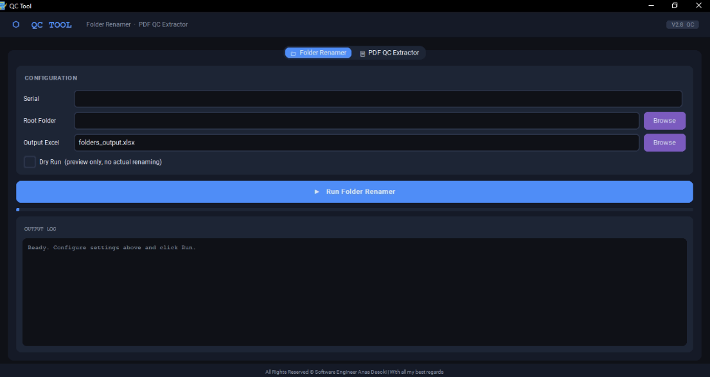

# Universal Document Nomenclature & Approval Extractor

An enterprise-grade desktop utility engineered to enforce strict document naming conventions and automate the extraction of consultant approval codes from any digital engineering submittal (Drawings, Material Approvals, RFIs, etc.) using spatial vector analysis.

## ⚠️ Repository Note
*This repository serves as a portfolio showcase of the architectural logic, spatial PDF parsing techniques, and UI/UX design. The proprietary Python source code is withheld to protect intellectual property.*

## 🚧 The Problem
In the construction industry, all types of submittals are returned by consultants with digital markups indicating the approval status (Code A, B, C, or D). 
1. **Manual Data Entry:** Document Controllers must open hundreds of diverse PDFs daily just to check the stamp and log the code into an Excel tracker.
2. **Naming Inconsistencies:** Files and ZIP archives are often named chaotically by different engineers, breaking the project's strict nomenclature and causing sorting collisions.

## 💡 The Solution & Core Features

### 1. Universal Approval Extraction (Native Digital PDFs)
* **Vector Geometry Detection:** Rather than relying on heavy OCR, the engine utilizes `PyMuPDF` to instantly scan digital (native) PDFs for specific vector shapes (e.g., bounding boxes or rectangles) drawn by consultants, **regardless of the markup color used**[cite: 4].
* **Coordinate-Based Text Extraction:** Once a markup boundary is detected, the engine calculates the coordinates and extracts the text (A, B, C, or D) located within or immediately adjacent to the bounding box[cite: 4].
* **Submittal Agnostic:** Works flawlessly across any document type (QC, IR, MIR, RFIs) as long as it is a native digital PDF.
* **Auto-Logging:** Generates a fully styled `openpyxl` Excel tracker detailing the file name, revision, and the spatially extracted Code (color-coded in the Excel sheet for quick visual sorting)[cite: 4].

### 2. Intelligent Nomenclature Engine (Folder & Archive Renamer)
* **Regex-Driven Standardization:** Automatically parses messy folder and archive names (`.zip`, `.rar`, `.7z`), strips out arbitrary spaces around hyphens, and formats the text into strict Title Case[cite: 4].
* **Smart Preservation:** Intelligently preserves data within brackets `()` or `[]` while standardizing the surrounding string to prevent data loss[cite: 4].
* **Dry Run Mode & Collision Prevention:** Features a 'Dry Run' simulation mode and collision detection to prevent accidental overwriting of identically named targets on case-insensitive file systems (like Windows)[cite: 4].

## 🛠 Tech Stack & Architecture
* **PDF Vector Parsing:** `PyMuPDF` (`fitz`) for highly optimized, native document geometry and text-block coordinate extraction without OCR overhead[cite: 4].
* **GUI Framework:** `customtkinter` featuring a modern, multi-tabbed Dark Mode interface[cite: 4].
* **Data Export:** `openpyxl` for dynamic, formatted Excel generation with custom cell coloring and frozen panes[cite: 4].
* **Concurrency:** `threading` to keep the UI responsive during batch processing of massive directories[cite: 4].

## 📸 Interface Preview

